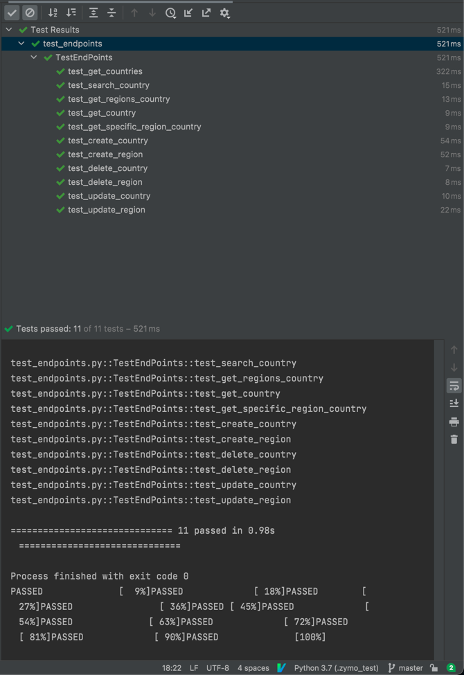

## Zymo Assignment
This BE server use fastAPI framework and postgresql for store data

All configuration have been define in docker compose file

```
services:
  backend:
    build:
      context: .
      dockerfile: Dockerfile.bezymo
    image: bezymo
    ports:
      - 3001:3001
    environment:
      DB_USER: zymo
      DB_PASSWORD: password#1
      DB_HOST: zymo_postgres
    depends_on:
      - db

    restart: unless-stopped

  db:
    image: postgres
    hostname: zymo_postgres
    environment:
      POSTGRES_USER: zymo
      POSTGRES_PASSWORD: password#1
      POSTGRES_DB: zymo_db
      PGDATA: /data/postgres
    volumes:
      - ./db/create_tables.sql:/docker-entrypoint-initdb.d/create_tables.sql
      - ./db/zymo_db_public_country.sql:/docker-entrypoint-initdb.d/zymo_db_public_country.sql
      - ./db/zymo_db_public_region.sql:/docker-entrypoint-initdb.d/zymo_db_public_region.sql
    ports:
      - 5432:5432
    restart: unless-stopped

```

### Build and run docker compose

```
docker-compose up -d --build
```

After that can access to [swagger](0.0.0.0:3001/docs)


### Running unit tests


Unit test endpoint



Unit test integration

